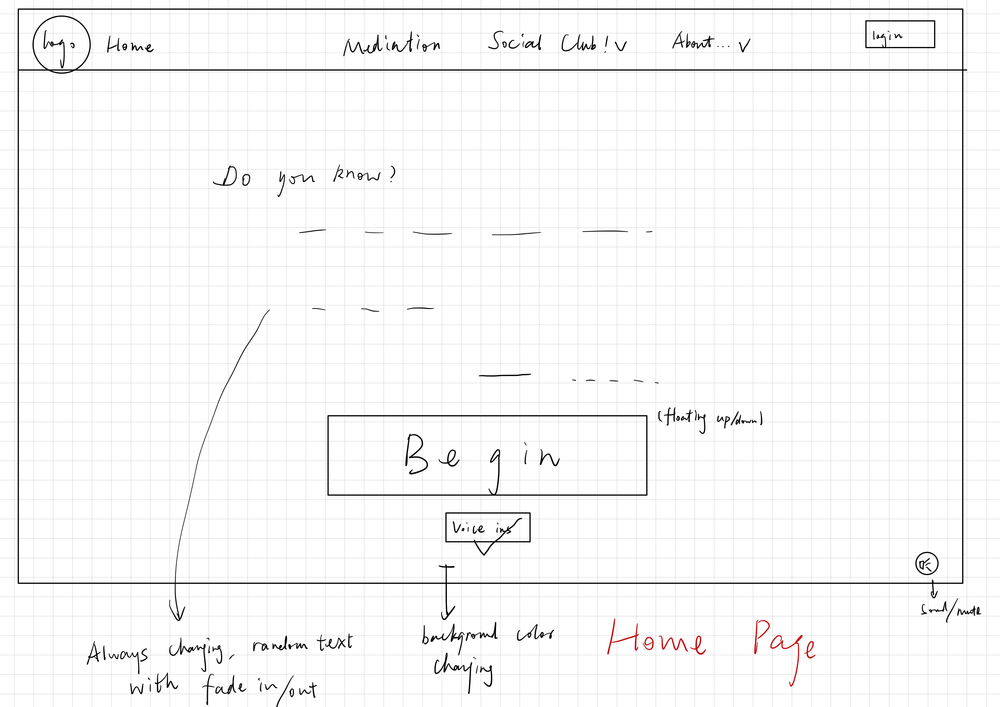
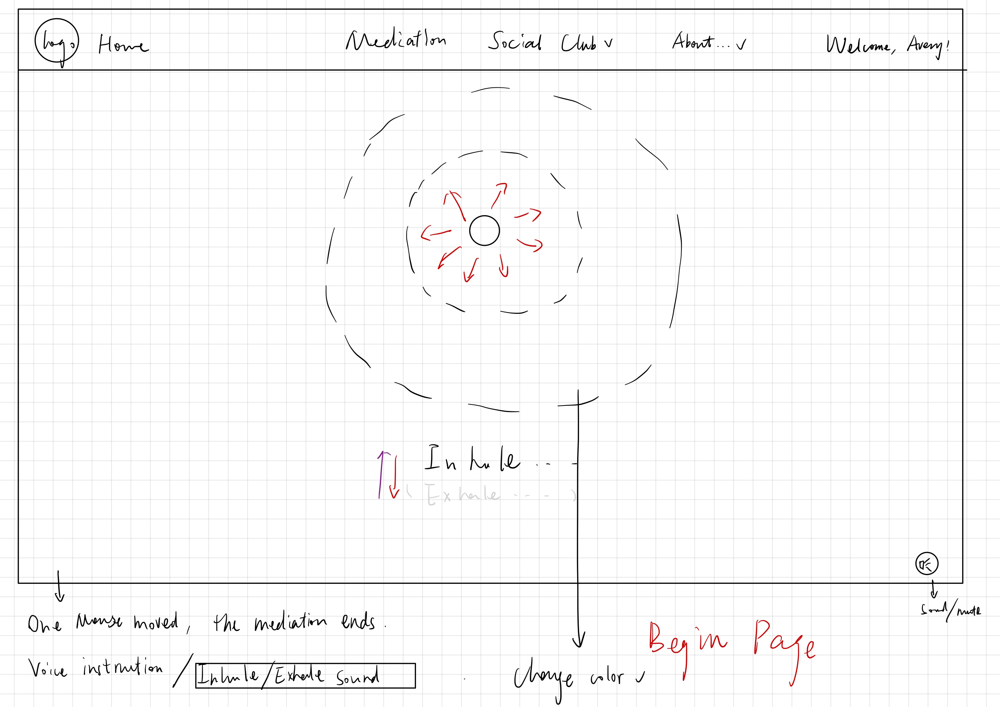
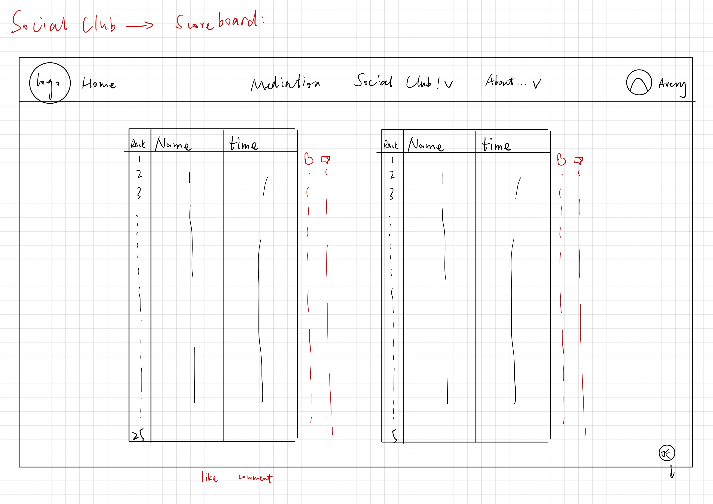
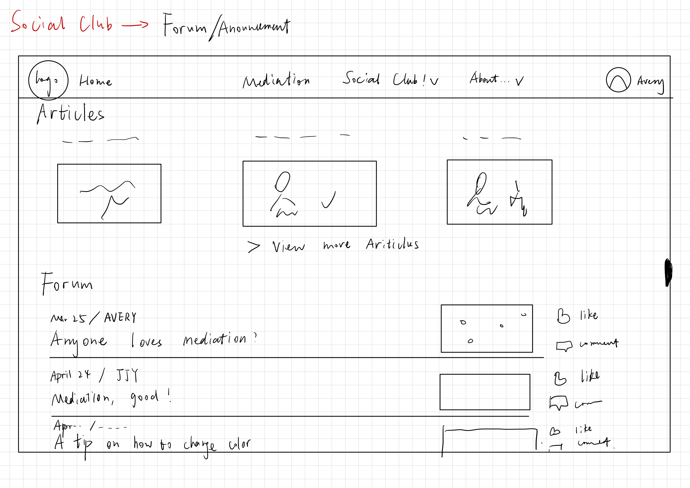
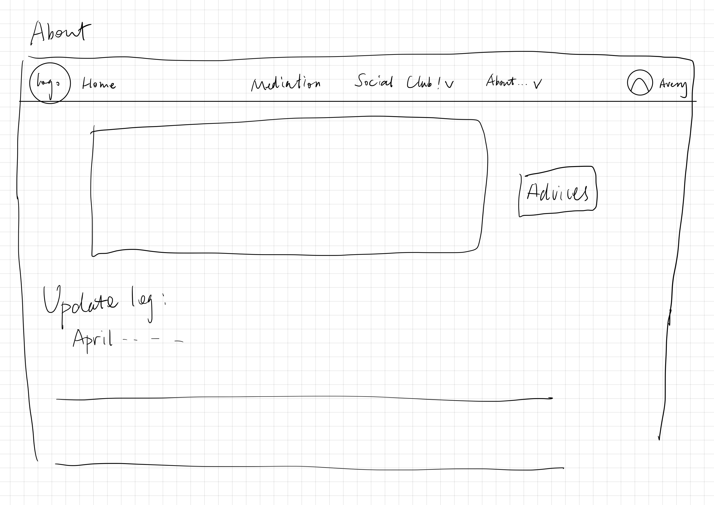
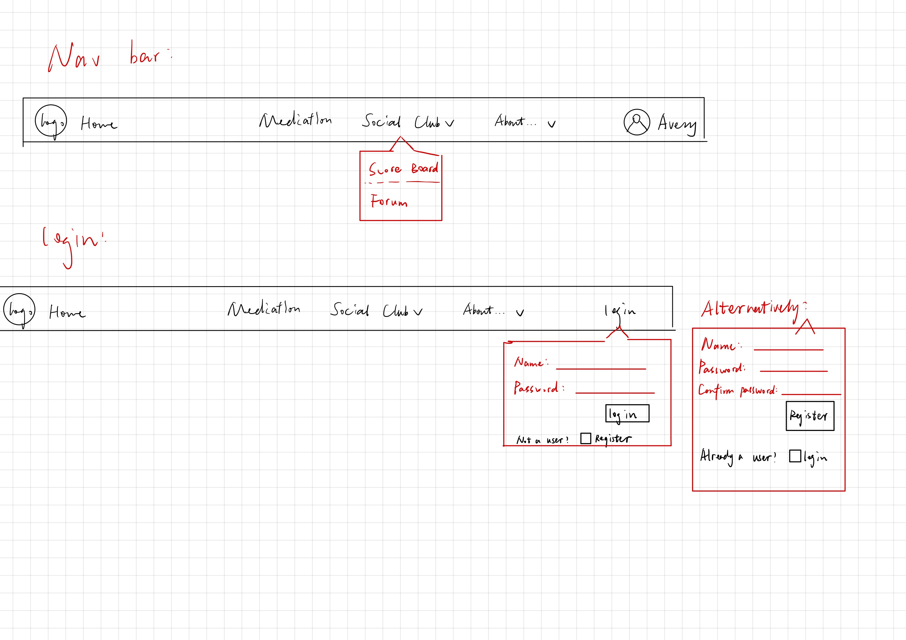
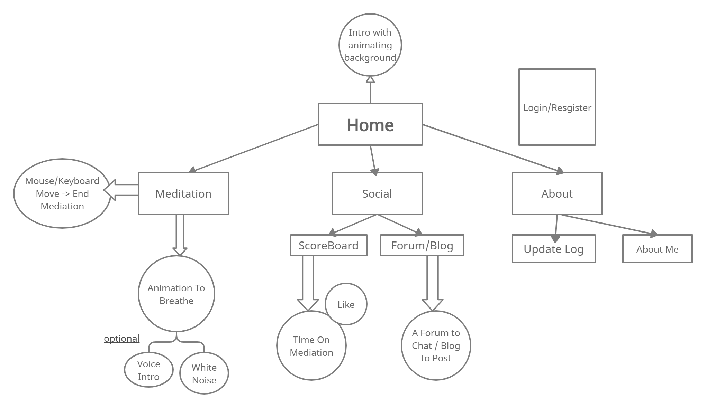

# Meditation Community (MeC)

  

## Overview

 In modern life, people are trapped in skyscrapers and busy work. Now, it is time to face their true self and calm down. Meditation would be one of the best ways to release yourself.

  

Meditation Community (MeC) is a web app that will allow users to meditate. Users can register and log in. Once they're logged in, they can save their meditation history and share it with everyone. They can also view and publish articles and blogs on the social club page. 
  
  

## Data Model

 

  

The application will store Users, Meditation history, and Blog articles.

  

* users can have multiple meditation histories and blog articles (via references)

* each Meditation history can have multiple records (by embedding)

* each Blog article will have a timestamp and an author. 

 

  

An Example User:

  

```javascript

{

username: "Avery",

hash: // a password hash,

history: // an array of references to History documents

blog: // an array of references to Blog documents

}

```

  

An Example History with Embedded Items:

  

```javascript

{

user: // a reference to a User object

past: [

{ time: "2022-03-25 16:25", duration: 25},
{ time: "2022-02-25 14:30", duration: 30},

],

createdAt: // timestamp

}

```

An Example Blog with Embedded Items:

  

```javascript

{

user: // a reference to a User object

past: [

{ time: "2022-03-25 16:25", content: '/medi-?user'},
{ time: "2022-02-25 14:30", content: '/title-?user'},

],


}

```

  
  

## [Link to Commented First Draft Schema](db.js)


  

## Wireframes


  

/ - main page/ start page

  



  

/medi - page for meditation

  



  

/social/board - page for score board

  



/social/forum - page for articles and blogs




/about/log - page for update log and advices



-login page is integrated on every page




  

## Site map

  




  

## User Stories or Use Cases


  

1. as non-registered user, I can register a new account with the site
2. as a non-registered user, I can meditate and view articles, but not save history and like/comment on the forum.

3. as a user, I can log in to the site

4. as a user, I can save my mediation history and show them on the scoreboard.

5. as a user, I can view all of my mediation histories.

6. as a user, I can view, like, or comment on the article/blog I like.

7. as a user, I can publish a new blog.
8. as a user, I can give my advice on improving the site to be better. 

  

## Research Topics

  

* (5 points) Integrate user authentication

* I'm going to be using passport for user authentication

* And account has been made for testing; I'll email you the password

* login and register page will be integrated on every page on the nav bar


* (3 points) tailwind.css
* used a CSS framework throughout my site.

* (3 points) React Frontend Framework
* use React Native framework in my website

* (3 points optional) Microsoft TTS API 
* use a TTS for reading text on the screen


  

9 points total out of 8 required points

  
  

## [Link to Initial Main Project File](app.js)


  

## Annotations / References Used

  

(__TODO__: list any tutorials/references/etc. that you've based your code off of_)

  

1. [passport.js authentication docs](http://passportjs.org/docs) - (add link to source code that was based on this)

2. [React JS Documentation](https://reactjs.org/docs/getting-started.html)
3. [Microsoft TTS API](https://docs.microsoft.com/en-us/azure/cognitive-services/speech-service/rest-text-to-speech)


## Some Notes by me

#Milestone2 Deploy: 
heroku login
git add .  
git commit -m "updated db" 
git push heroku HEAD:master
heroku open
MileStone2-- commit SHA:
7751dccffda6fe3810f6d5a3974184514c5afe3c

Milestone2 Deploy website: 
https://secret-bayou-79955.herokuapp.com/ | https://git.heroku.com/secret-bayou-79955.git


-------------------------------------------------
#Milestone3 Deploy:


Milestone3 website:
https://meditation-milestone-3.herokuapp.com/ | https://git.heroku.com/meditation-milestone-3.git

https://meditation-milestone-3.herokuapp.com/ | https://git.heroku.com/meditation-milestone-3.git


Other things: 
git remote add prod-heroku GIT_URL
git push prod-heroku 

heroku logs --remote milestone3